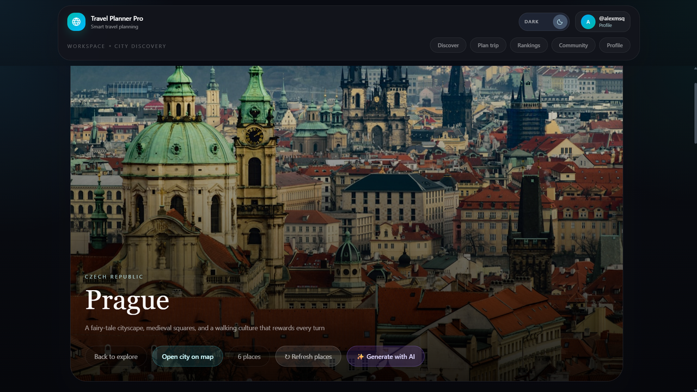
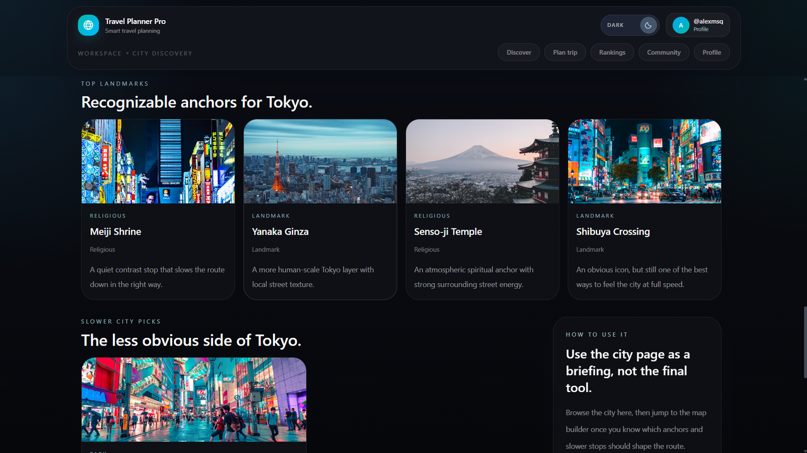
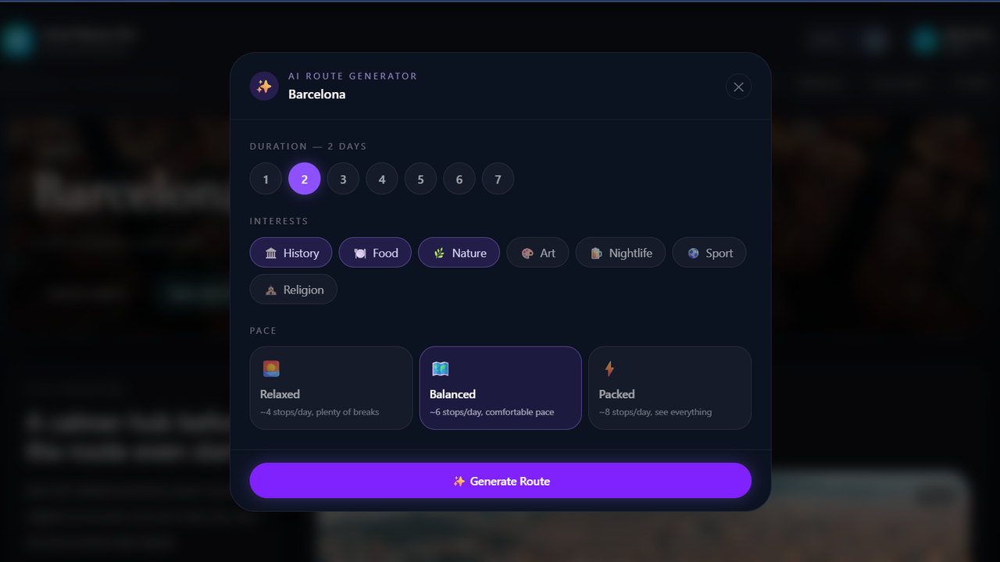
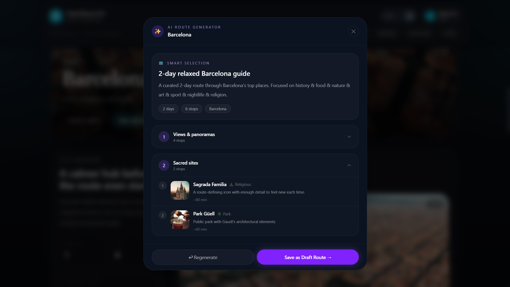
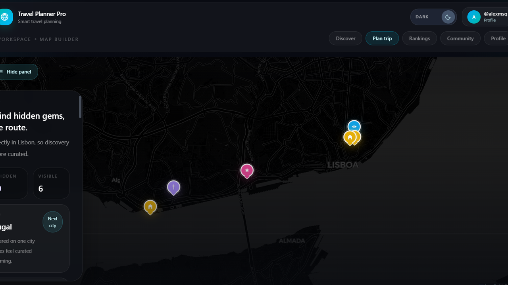
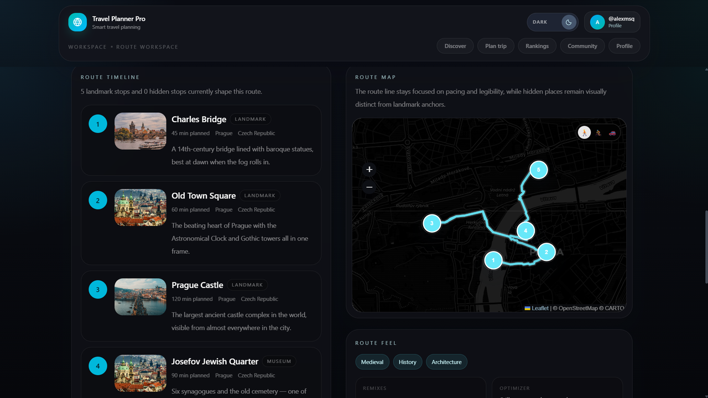
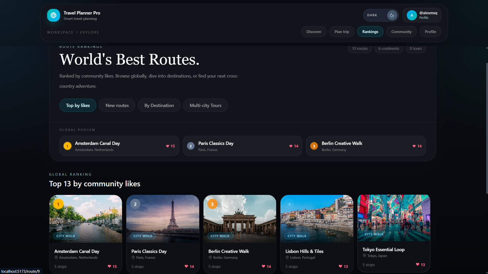

# 🗺️ Travel Planner Pro

> Bachelor's diploma project — WSB Merito Wrocław, 2025

A full-stack web application for planning city trips. Browse points of interest on an interactive map, build custom multi-day routes, and get AI-generated itineraries powered by OpenAI GPT-4o-mini.


---

## ✨ Features

| Feature | Details |
|---------|---------|
| 🔐 **Authentication** | JWT-based login/register, role-based access (admin / user) |
| 🗺️ **Interactive map** | POI browser powered by Leaflet.js + OpenStreetMap data |
| 📍 **Route builder** | Create and manage multi-day routes with drag-and-drop stops |
| 🤖 **AI itinerary** | GPT-4o-mini generates personalized day plans based on interests and pace |
| 🚗 **Smart routing** | Walking / cycling / driving directions via OSRM with automatic route optimization |
| 📦 **OSM import** | Import hundreds of POIs for any city via Overpass API in one click |
| 🏆 **Gamification** | Achievement system and leaderboard for active users |
| 💰 **Budget tracker** | Per-route expense tracking with category breakdown |

---

## 🏗️ Architecture

```
        ┌───────────────────────────────────┐
        │   React 18 + TypeScript  (Vite)   │
        │   Leaflet.js  ·  Tailwind CSS     │
        └────────────────┬──────────────────┘
                         │  REST API (JSON + JWT)
        ┌────────────────▼──────────────────┐
        │       Spring Boot 3  REST API     │
        │  Spring Security · JPA/Hibernate  │
        └──────┬───────────┬───────────┬────┘
               │           │           │
        ┌──────▼──┐  ┌──────▼──┐  ┌───▼──────────┐
        │Postgres │  │  OpenAI │  │OpenStreetMap │
        │  (JPA)  │  │GPT-4o-m.│  │Overpass+OSRM │
        └─────────┘  └─────────┘  └──────────────┘
```

---

## 🛠️ Tech Stack

| Layer | Technology |
|-------|-----------|
| **Backend** | Java 21, Spring Boot 3, Spring Security + JWT, JPA / Hibernate |
| **Frontend** | React 18, TypeScript, Vite, Tailwind CSS, Leaflet.js |
| **Database** | PostgreSQL 15 |
| **AI** | OpenAI GPT-4o-mini (with algorithmic fallback when no key is set) |
| **Maps** | OpenStreetMap, Overpass API, OSRM (routing) |
| **Infrastructure** | Docker, Docker Compose |

---

## 🚀 Getting Started

### Prerequisites
- Java 21+
- Node.js 18+
- Docker & Docker Compose
- OpenAI API key *(optional — falls back to built-in algorithm)*

### 1. Start the database

```bash
cd backend
docker-compose up -d
```

### 2. Configure environment

```bash
cp .env.example .env
```

Fill in `.env`:
```env
DB_PASSWORD=your_password
JWT_SECRET=your-secret-key-min-32-chars
OPENAI_API_KEY=sk-...          # optional
```

### 3. Run the backend

```bash
./mvnw spring-boot:run
```

API → `http://localhost:8080`

### 4. Run the frontend

```bash
cd frontend
npm install
npm run dev
```

App → `http://localhost:5173`

---

## 📡 API Overview

| Method | Endpoint | Auth | Description |
|--------|----------|------|-------------|
| `POST` | `/api/auth/register` | ✗ | Register new user |
| `POST` | `/api/auth/login` | ✗ | Login, returns JWT |
| `GET` | `/api/cities` | ✗ | List available cities |
| `GET` | `/api/pois?cityId=` | ✗ | Get points of interest |
| `POST` | `/api/routes` | ✓ | Create a route |
| `GET` | `/api/routes/{id}` | ✗ | Get route with stops |
| `POST` | `/api/routes/{id}/optimize` | ✓ | Reorder stops by proximity |
| `POST` | `/api/ai/generate` | ✓ | Generate AI itinerary |
| `POST` | `/api/osm/import/{cityId}` | admin | Import POIs from OpenStreetMap |

---

## 📸 Screenshots

### City Discovery


### City Landmarks


### AI Route Generator


### AI-Generated Itinerary


### Map Builder


### Route Workspace


### Community Rankings


---

## 💡 Technical Highlights

- **AI with fallback** — when OpenAI is unavailable the app switches to a deterministic route-building algorithm, so the feature never fully breaks
- **Route optimization** — Nearest Neighbour algorithm over Haversine distances reorders stops to minimize walking distance
- **OSM integration** — Overpass QL queries fetch amenity / tourism / leisure / historic nodes within a configurable city radius and map them to internal categories
- **Stateless security** — JWT filter runs on every request; no server-side sessions
- **Quality scoring** — imported POIs are ranked by data completeness (website, hours, description) so the AI prompt always gets the best candidates first

---

## 👤 Author

**Aliaksandr Dailid**

[](https://github.com/a1exmsq)
[](https://www.linkedin.com/in/aliaksandr-dailid-63b814246)
